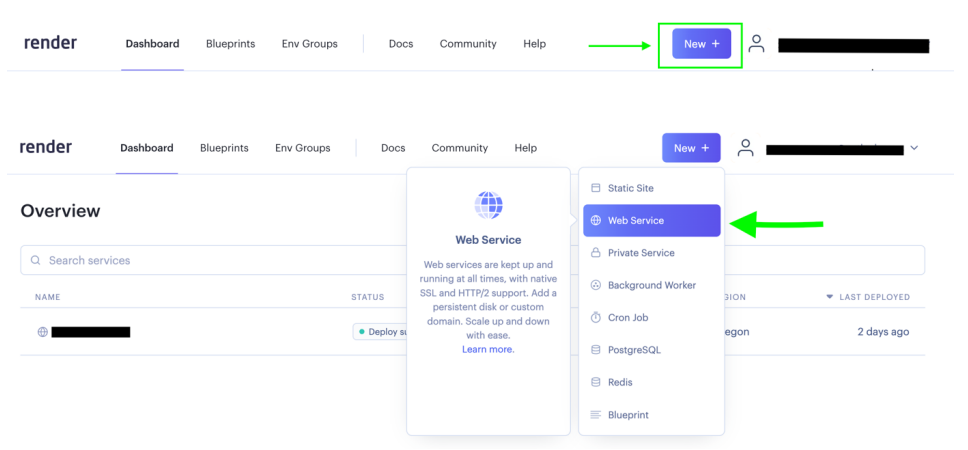
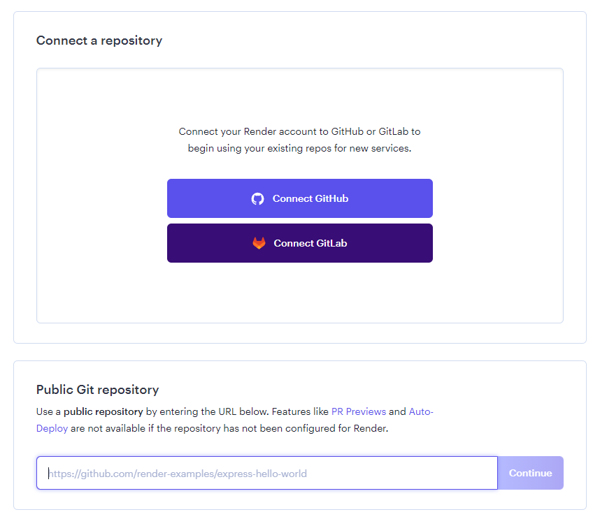
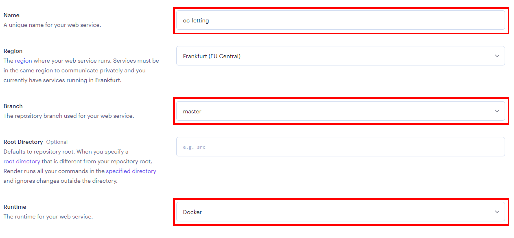
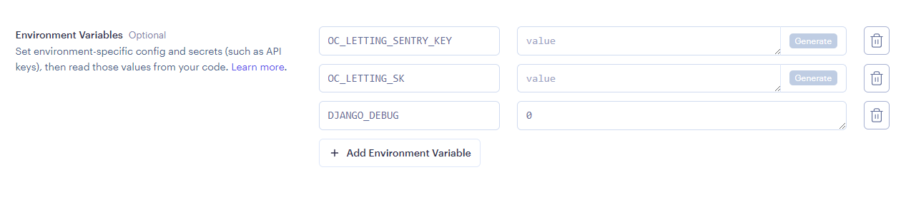
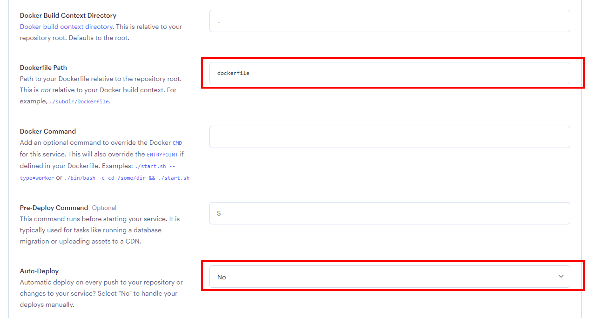
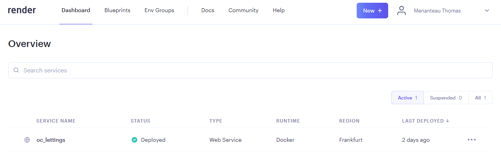
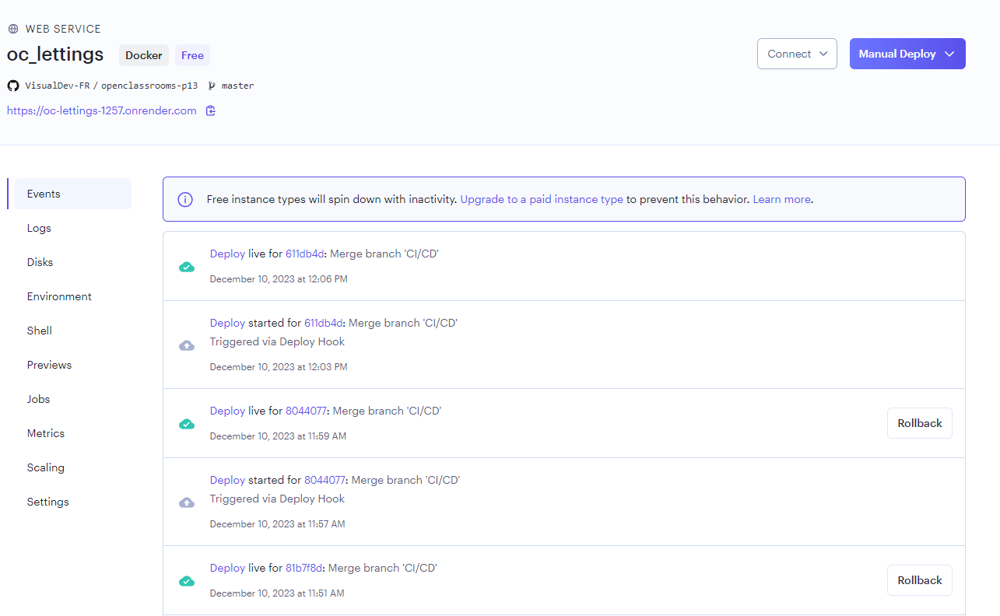
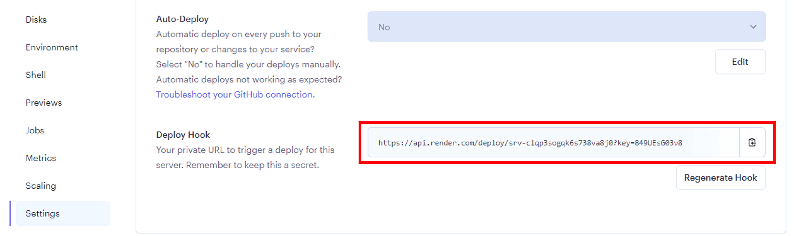

Deploying
====

This project is hosted on `Render <https://render.com/>`_, which offers a free and simple way to host a web app with a single service.

Deploy with Render
----

To deploy the app on Render, follow this procedure:

1. Create a new Web Service

2. Build and deploy from a Git repository

.. image:: ./_static/render_02.PNG

3. Connect a repository

Connect to GitHub / GitLab, or provide the URL of your public repository.

4. Configure the Web Service

Specify the name of the project, the main branch of the project's repository, and the runtime as **Docker**.

5. Configure necessary environment variables

See :ref:`this section <prerequisites>` for more details about the necessary environment variables.

6. Configure Docker

Specify the relative path of the Dockerfile and disable auto-deploy.

7. Deploy the website by clicking on the dedicated button at the bottom of the page.

Administrate with Render
----

Once the website is deployed, it will become available in your dashboard:

Then, you'll have access to the administration panel of Render, offering you the possibility to administate the deployed website:

Automate the Deployment
----

To relaunch automated deployment from an external service (such as a CI/CD pipeline), you'll need to get a Deploy hook, which is a URL to make requests to, in order to tell Render to relaunch the deployment of the website from your repository.

To get the webhook, go to Settings / Build and Deploy and copy the URL in the "Deploy hook" section:

.. warning::
    Ensure to keep the URL secret.

Then, to relaunch the build and deployment of your app, just send a request to the given deploy hook:

.. code:: bash

    curl https://deploy/hook/url
