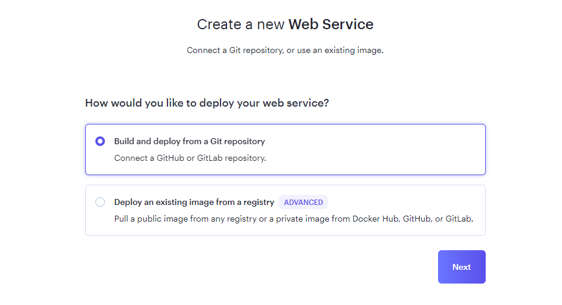

Deploying
====

This project is hosted on `render <https://render.com/>`_, which offers a free and simple way to host a web app with a single service.

To deploy the app on render, follow this procedure :

1. Create a new Web Service

.. image:: ./_static/render_01.PNG

2. Build and deploy from a git repository

3. Connect a repository

.. image:: ./_static/render_03.PNG

Connect to Github / Gitlab, or give the url of your public repository.

4. Configure the web Service

Specify the name of the project, the main branch of the project's repository, and the runtime as **Docker**

5. Configure needed environement variables

See :ref:`this section <prerequisites>` for more details about needed environement variables.

.. image:: ./_static/render_05.PNG

6. Configure Docker

Specify the relative path of the dockerfile, and disable the auto-deploy.

.. image:: ./_static/render_06.PNG

7. Deploy the web site by clicking on the dedicated button at the bottom of the page.